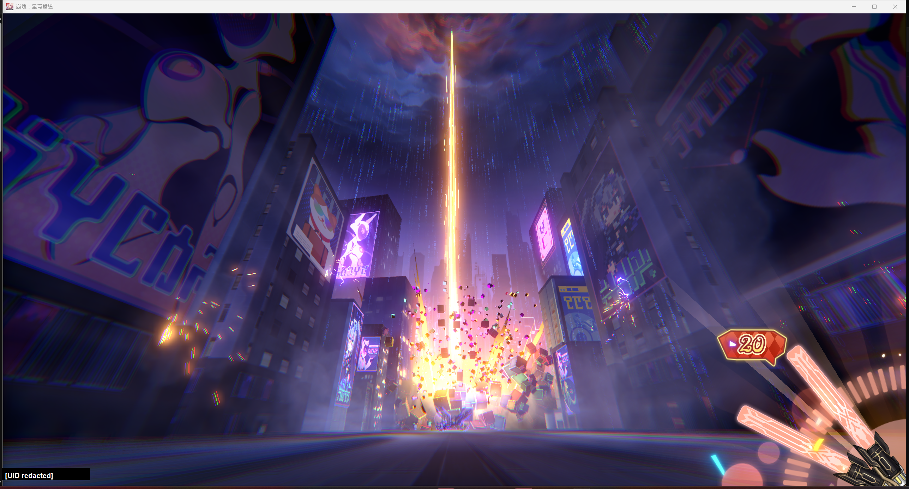
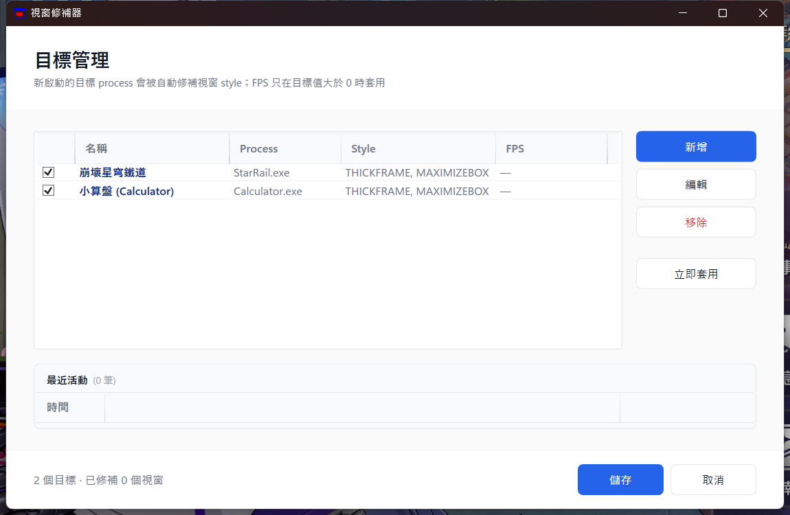

# HSR Window Tools / WindowPatcher v6

[](https://github.com/ImL1s/hsr-window-tools/actions/workflows/ci.yml)
[](https://github.com/ImL1s/hsr-window-tools/actions/workflows/release.yml)
[](https://github.com/ImL1s/hsr-window-tools/releases/latest)

## Screenshots

<table>
  <tr>
    <td align="center"><strong>HSR window with thickframe (resizable + maximizable)</strong></td>
    <td align="center"><strong>Settings window — target management UI</strong></td>
  </tr>
  <tr>
    <td></td>
    <td></td>
  </tr>
  <tr>
    <td>StarRail.exe window after patching: standard Windows title bar with min/max/close buttons, draggable border, snap-able by FancyZones / Win+arrow. (UID redacted)</td>
    <td>WPF Fluent UI tray app: target list (StarRail / Calculator) with style indicators, primary actions on right (red Delete = destructive), activity feed at bottom.</td>
  </tr>
</table>

[繁體中文](#繁體中文) | [English](#english)

---

## English

Windows PowerShell tooling that makes Honkai: Star Rail and similar Unity game windows resizable, maximizable, and compatible with Windows Snap / PowerToys FancyZones.

### What it does

- Detects target game processes and adds `WS_THICKFRAME + WS_MAXIMIZEBOX` to their windows.
- Makes the window draggable by border, maximizable, and Snap/FancyZones-friendly.
- Runs as a WPF tray app, with legacy one-shot patch scripts still available.
- Requires administrator privileges when patching elevated game windows; UAC behavior depends on local policy.

### Quick start

```powershell
# Start tray mode
.\WindowPatcher\WindowPatcher.bat

# CLI smoke checks
pwsh -NoProfile -ExecutionPolicy Bypass -File .\WindowPatcher\WindowPatcher-WPF.ps1 --help
pwsh -NoProfile -ExecutionPolicy Bypass -File .\WindowPatcher\WindowPatcher-WPF.ps1 --status
pwsh -NoProfile -ExecutionPolicy Bypass -File .\WindowPatcher\WindowPatcher-WPF.ps1 --scan-now

# Legacy one-shot patch for StarRail.exe
.\APPLY-PATCH.bat
```

### FPS note (2026-05 真實測試確認)

End-to-end test on a live StarRail (PID 35188) verified: HSR **still uses** the single
`GraphicsSettings_Model_h2986158309` JSON binary key (DJB2 hash 5/5 matches).
The key was previously absent only because the user had never opened the in-game
graphics settings panel. After clicking any setting + ESC, HSR writes the full
JSON blob and our wizard correctly diffs + patches FPS to 120.

**Zero-to-hero flow (verified)**:
1. Start tray (`WindowPatcher\WindowPatcher.bat`) — tray auto-elevates and watches game processes
2. Start HSR — tray polling injects `WS_THICKFRAME + WS_MAXIMIZEBOX` within 2s
3. (One-time FPS prep) In HSR: ESC → Settings → Graphics → toggle FPS / any setting → ESC out
4. Right-click tray icon → **FPS Probe Wizard** → 確定 to baseline
5. Repeat step 3 once after baseline (this writes the registry key)
6. Wizard auto-detects HSR exit OR you can re-run `--wizard-diff` to apply 120 FPS
7. Restart HSR — registry now has `{"FPS":120,...}`, game honors it

FPS tooling is disabled by default for HSR (`fpsProfile = "none"`, `fpsTarget = 0`)
to avoid noisy "key not found" while baseline isn't set. Activate via tray menu or
`WindowPatcher\RegProbe.ps1` when you actually want to flip the bit.

### Key files

| Path | Purpose |
| --- | --- |
| `WindowPatcher/WindowPatcher-WPF.ps1` | Main WPF tray app and CLI entry point |
| `WindowPatcher/WindowPatcher.bat` | Tray launcher |
| `WindowPatcher/reload-admin.ps1` | Restart tray app elevated |
| `HSR-Patch.ps1` | Legacy one-shot StarRail window patcher |
| `APPLY-PATCH*.bat` | Legacy wrapper scripts, optionally resizing the window |
| `HsrWatcher.ps1` | Legacy polling watcher |
| `Install-Watcher.bat` / `Uninstall-Watcher.bat` | Legacy scheduled-task watcher management |
| `WindowPatcher/RegProbe.ps1` | Registry diff helper for FPS key discovery |
| `WindowPatcher/FPS-Wizard.ps1` | CLI FPS probe wizard wrapper |

### Verification snapshot

The project has been smoke-tested against a live StarRail window:

- `--help`, `--list`, `--status`, `--scan-now`, `--apply StarRail`, and `--diagnose` returned successfully.
- Live StarRail window style contained both `THICKFRAME=True` and `MAXIMIZEBOX=True`.
- Temporary resize/restore checks confirmed the patched window can be resized and restored.
- `APPLY-PATCH*.bat` wrappers were tested with automatic restore.
- All tracked PowerShell scripts passed parser checks.

### Risks and limitations

- This tool manipulates another process's window style via Win32 APIs and may require elevation.
- The launchers use `ExecutionPolicy Bypass` for local unsigned scripts; inspect the source and only run copies from this repository.
- Restarting the game window restores the original window style; the patch is not permanent.
- FPS registry changes are a separate risk surface from window style patching and are not enabled by default for HSR.
- The legacy scheduled-task watcher runs from the local script path with highest privileges; install it only from a trusted, non-shared folder.
- Use at your own risk; game publisher policies may change.

### Uninstall

```powershell
# Stop tray process
Get-CimInstance Win32_Process -Filter "Name = 'pwsh.exe'" |
  Where-Object { $_.CommandLine -like '*WindowPatcher-WPF.ps1*' } |
  ForEach-Object { Stop-Process -Id $_.ProcessId -Force }

# Remove user config/logs
Remove-Item "$env:LOCALAPPDATA\WindowPatcher" -Recurse -Force
```

---

## 繁體中文

這是一組 Windows PowerShell 工具，用來讓《崩壞：星穹鐵道》和類似 Unity 遊戲視窗可以拖曳邊框、最大化，並能被 Windows Snap / PowerToys FancyZones 正常抓取。

### 核心功能

- 偵測目標遊戲 process，為視窗補上 `WS_THICKFRAME + WS_MAXIMIZEBOX`。
- 讓原本鎖死大小的視窗可以拖曳邊框、最大化、Snap、FancyZones。
- 主要介面是 WPF 托盤程式；舊版一次性 patch 腳本仍保留。
- 修補高權限遊戲視窗時需要管理員權限；是否能完全 zero-touch 取決於本機 UAC 政策。

### 快速開始

```powershell
# 啟動托盤模式
.\WindowPatcher\WindowPatcher.bat

# CLI 基本檢查
pwsh -NoProfile -ExecutionPolicy Bypass -File .\WindowPatcher\WindowPatcher-WPF.ps1 --help
pwsh -NoProfile -ExecutionPolicy Bypass -File .\WindowPatcher\WindowPatcher-WPF.ps1 --status
pwsh -NoProfile -ExecutionPolicy Bypass -File .\WindowPatcher\WindowPatcher-WPF.ps1 --scan-now

# 舊版 StarRail.exe 一次性 patch
.\APPLY-PATCH.bat
```

### FPS 說明 (2026-05 真實測試確認)

對活 HSR (PID 35188) 端到端測試確認:HSR **仍使用** 單一 `GraphicsSettings_Model_h2986158309` JSON binary key (DJB2 hash 演算法已驗證 5/5 命中)。先前看不到此 key 純粹是因為使用者**從未開過遊戲內畫面設定**,只要進設定隨便動一個選項 + ESC,HSR 就會把完整 JSON blob (含 `"FPS":N`) 寫入 registry,wizard 立刻能 diff + patch 為 120。

**從零到 120 FPS 完整流程 (已驗證 work)**:
1. 啟動 tray (`WindowPatcher\WindowPatcher.bat`) — tray 自動提權並 watch 遊戲 process
2. 啟動 HSR — tray 約 2 秒內注入 `WS_THICKFRAME + WS_MAXIMIZEBOX`
3. (一次性 FPS 準備) HSR 內: ESC → 設定 → 畫面 → 切換 FPS / 任意選項 → ESC 離開
4. 右下角托盤 → 右鍵 → **FPS 探查精靈** → 確定建基線
5. 此基線之後,wizard 會 watch HSR 退出;之後在 HSR 內動任意設定再 ESC,wizard 自動 diff + patch
6. 重啟 HSR — registry 已含 `{"FPS":120,...}`,遊戲讀到後即生效

FPS tweak 預設不啟用 (`fpsProfile = "none"`, `fpsTarget = 0`) 是為了避免「找不到 key」噪音 — 透過托盤選單的 **FPS 探查精靈** 或 `WindowPatcher\RegProbe.ps1` 主動開啟即可。

### 主要檔案

| 路徑 | 用途 |
| --- | --- |
| `WindowPatcher/WindowPatcher-WPF.ps1` | 主程式，WPF 托盤 app 與 CLI 入口 |
| `WindowPatcher/WindowPatcher.bat` | 托盤啟動器 |
| `WindowPatcher/reload-admin.ps1` | 重新啟動托盤並提權 |
| `HSR-Patch.ps1` | 舊版 StarRail 一次性視窗修補 |
| `APPLY-PATCH*.bat` | 舊版 wrapper，可選擇 resize |
| `HsrWatcher.ps1` | 舊版 polling watcher |
| `Install-Watcher.bat` / `Uninstall-Watcher.bat` | 舊版排程 watcher 安裝/移除 |
| `WindowPatcher/RegProbe.ps1` | FPS key 探查用 registry diff helper |
| `WindowPatcher/FPS-Wizard.ps1` | CLI 版 FPS 探查精靈 wrapper |

### 實測摘要

已對 live StarRail 視窗做過安全 smoke test：

- `--help`、`--list`、`--status`、`--scan-now`、`--apply StarRail`、`--diagnose` 都能正常返回。
- live StarRail 視窗 style 已包含 `THICKFRAME=True` 與 `MAXIMIZEBOX=True`。
- 實際 resize / restore 測試確認視窗可被調整大小並還原。
- `APPLY-PATCH*.bat` wrapper 已測試，並在測試後自動還原視窗大小。
- 所有已追蹤的 PowerShell 腳本通過 parser check。

### 風險與限制

- 本工具透過 Win32 API 操作其他 process 的視窗 style，可能需要管理員權限。
- 啟動器會使用 `ExecutionPolicy Bypass` 執行本機未簽章腳本；請先檢查來源，只執行本 repo 的可信副本。
- 視窗 style 修補不是永久修改；重啟遊戲視窗後會回到原狀。
- FPS registry 改寫和視窗 style 修補是不同風險面，且 HSR 預設不啟用 FPS patch。
- 舊版排程 watcher 會從本機腳本路徑以最高權限執行；只建議從可信、非共用資料夾安裝。
- 遊戲廠商政策可能改變，請自行承擔使用風險。

### 卸載

```powershell
# 停止托盤 process
Get-CimInstance Win32_Process -Filter "Name = 'pwsh.exe'" |
  Where-Object { $_.CommandLine -like '*WindowPatcher-WPF.ps1*' } |
  ForEach-Object { Stop-Process -Id $_.ProcessId -Force }

# 移除使用者設定與 log
Remove-Item "$env:LOCALAPPDATA\WindowPatcher" -Recurse -Force
```
